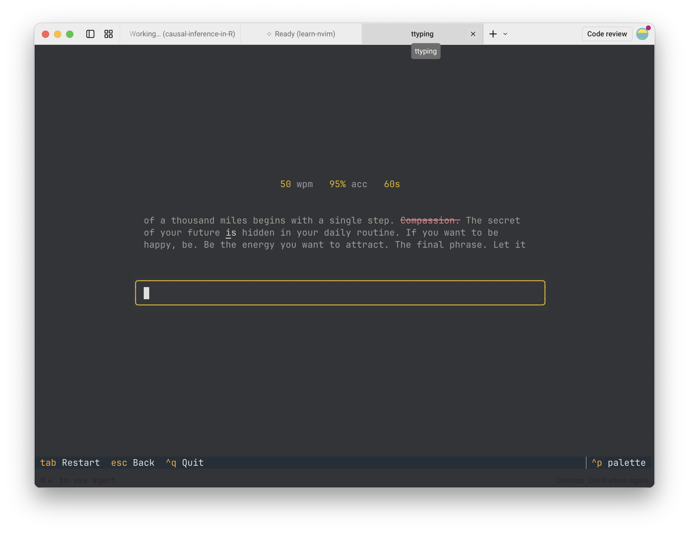

# ttyping ⌨️

[한국어](README.md) | [English](README.en.md)



Python과 [Textual](https://github.com/Textualize/textual)로 제작된 간결하고 미니멀한 터미널 타자 연습 프로그램입니다 (Monkeytype 스타일).

`ttyping`은 터미널 환경에서 깔끔하고 몰입감 있는 타자 연습 환경을 제공합니다. 타자 속도(WPM)와 정확도를 측정하며, 연습 결과는 로컬에 안전하게 저장되어 기록을 확인할 수 있습니다.

## ✨ 주요 기능

- **다양한 언어 및 자판 지원**: 영어 (QWERTY, Dvorak, Colemak), 한글 (두벌식, 세벌식), 다양한 프로그래밍 언어 (Python, Rust, R, JavaScript, TypeScript, Go, C, Julia, Typst, Markdown).
- **손가락 및 키보드 열별 연습**: 자리별(가운데 줄, 윗줄, 아랫줄, 숫자/특수문자 줄 등) 및 손가락별 연습으로 운지법과 근육 기억을 향상시킵니다.
- **다채로운 연습 모드**: 단어 연습, 짧은 글, 명언(Quotes), 로렘 입숨(Lorem Ipsum), 오늘의 연습(Daily Challenge).
- **목표 정확도 모드**: 설정한 목표 정확도 미달 시 자동으로 재시작되는 집중 훈련 모드.
- **상세 통계 및 시각화**: 타건 리듬 일관성(Consistency) 점수, 키보드 에러 히트맵, 글자별 타건 속도 맵(Speed Map), WPM 및 정확도 추세 그래프.
- **로컬 기록 관리 및 내보내기**: 과거 타자 연습 기록을 조회하고 CSV 및 JSON 형식으로 내보내기 지원.

## 🚀 설치 방법

`uv`를 사용한 설치 (권장):

```bash
uv tool install ttyping
```

설치 없이 즉시 실행하기:

```bash
uvx ttyping
```

## 🎮 사용 방법

### 기본 실행
```bash
# 기본 영어 타자 연습 시작
uvx ttyping

# 한글 타자 연습 시작
uvx ttyping --lang ko

# 코드 타이핑 연습 (예: Python, Rust, Go, TypeScript 등)
uvx ttyping --lang python

# 연습할 단어 수 지정 (1~1000)
uvx ttyping --words 50

# 제한 시간 설정 (초 단위)
uvx ttyping --time 60

# 목표 정확도 설정 (정확도가 떨어지면 자동 재시작)
uvx ttyping --target-accuracy 95

# 로컬 텍스트 파일로 연습
uvx ttyping --file practice.txt

# 원격 URL 텍스트로 연습
uvx ttyping --url https://example.com/text.txt

# 과거 연습 기록 확인
uvx ttyping history
```

## ⌨️ 단축키 안내

### 메인 메뉴
| 단축키 | 기능 |
|--------|------|
| **e** / **ㄷ** | 영어 타자 메뉴 |
| **k** / **ㅏ** | 한글 타자 메뉴 |
| **p** / **ㅔ** | 코드 타이핑 메뉴 |
| **w** / **ㅈ** | 약점 단어 / 오류 분석 |
| **h** / **ㅗ** | 기록 보기 (History) |
| **o** / **ㅐ** | 설정 (Options) |
| **q** / **Esc** / **ㅂ** | 종료 |

### 타자 연습 중
| 단축키 | 기능 |
|--------|------|
| **Space** | 현재 단어 완료 후 다음 단어로 이동 |
| **Enter** | 현재 단어 완료 / 제출 |
| **Ctrl+W** | 현재 입력한 단어 지우기 |
| **Tab** | 현재 테스트 재시작 |
| **Esc** | 이전 메뉴로 돌아가기 |

### 기록 화면
| 단축키 | 기능 |
|--------|------|
| **d** / **ㅇ** | 선택한 기록 삭제 |
| **Shift+D** | 전체 기록 삭제 |
| **x** | 기록 CSV 파일로 내보내기 |
| **j** | 기록 JSON 파일로 내보내기 |
| **Esc** | 이전 메뉴로 돌아가기 |

## 🗺️ 최근 업데이트 내역

### 연습 모드
- ✅ **명언 모드**: 문장 부호와 대소문자가 포함된 한국어/영어 명언 연습.
- ✅ **짧은 글 & 로렘 입숨 모드**: 자연스러운 문장 및 Lorem Ipsum 텍스트 생성 연습.
- ✅ **시간 프리셋**: 설정 메뉴 및 CLI에서 15초 / 30초 / 60초 / 120초 빠른 선택 지원.

### 피드백 및 통계
- ✅ **키보드 히트맵**: 약점 분석 화면에서 누적 오타 위치를 시각화한 레이아웃 맵.
- ✅ **속도 맵 (Speed Map)**: 결과 화면에서 글자별 입력 속도를 색상으로 시각화.

### UX 및 사용자 맞춤 설정
- ✅ **커스텀 테마**: 깔끔한 다크/라이트 테마 지원.
- ✅ **기록 내보내기**: 연습 기록을 CSV (`x`) 또는 JSON (`j`)으로 저장.

### 콘텐츠
- ✅ **프로그래밍 언어 지원**: Python, Rust, R, JavaScript, TypeScript, Go, C, Julia, Typst, Markdown 코드 연습.
- ✅ **원격 텍스트 로드**: HTTP(S) URL로부터 연습 텍스트 직접 가져오기 (`--url`).

## 🛠️ 기술 스택

- **언어**: Python 3.10+
- **TUI 프레임워크**: [Textual](https://github.com/Textualize/textual)
- **스타일링**: [Rich](https://github.com/Textualize/rich)
- **데이터 저장**: `~/.ttyping/results.json`

## 📄 라이선스

Apache-2.0
